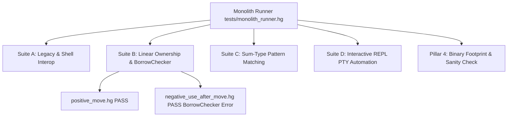

# MAN PAGE: Borrow Checker & Unstable Features (`feature/borrow-checker-unstable`)

> **Dialects**: Hinglish (`.hg`) & English (`.eg`)  
> **Status**: [UNSTABLE / STAGING] (`feature/borrow-checker-unstable` branch)  
> **Category**: Memory Safety, Sum-Types & Pattern Matching

---

## ⚠️ Staging Feature Warning Banner

> [!WARNING]
> The features, syntax keywords, and compiler diagnostics described in this manual page are currently experimental on the `feature/borrow-checker-unstable` branch. Standard production compilers default to standard automatic reference counting (ORC). Opt-in static borrow checking requires strict procedure declarations (`pakka kaam` / `strict task`).

---

## 1. Opt-In Borrow Checker

### Syntax Signatures
```hinglish
// Hinglish Dialect (.hg)
pakka kaam function_name(param1: Type1): ReturnType toh
    // Procedure body with static borrow checking
khatam
```

```english
// English Dialect (.eg)
strict task function_name(param1: Type1): ReturnType do
    // Procedure body with static borrow checking
done
```

### Description & Rules
- Declaring a procedure with `pakka kaam` or `strict task` opts that subroutine into compile-time ownership tracking.
- Variables passed into or assigned with move operations transfer their unique ownership handle.
- Re-accessing a variable after its ownership has been moved triggers a compile-time error (`[Galti - BorrowChecker]` or `[Error - BorrowChecker]`).

---

## 2. Explicit Move Semantics

### Move Expression Syntax
- **Hinglish (`.hg`)**: `chala_gaya identifier`
- **English (`.eg`)**: `moved identifier`

### Code Walkthrough (Positive Use Case)

```hinglish
kaam print_val(v: string) toh
    dikhao "Passed value:", v
khatam

kaam main() toh
    rakho item = "ValidItem"
    print_val(chala_gaya item)
khatam

main()
```

```english
task print_val(v: string) do
    show "Passed value:", v
done

task main() do
    keep item = "ValidItem"
    print_val(moved item)
done

main()
```

### Compile-Time Error Contract (Negative Use Case)

When a variable is moved, its binding in the local scope is marked as invalid. Any subsequent attempt to pass, print, or compute with the variable produces a static compiler error.

```hinglish
kaam main() toh
    rakho secret = "MySecret"
    rakho moved_secret = chala_gaya secret
    dikhao secret  // ❌ Static Analysis Failure!
khatam
```

#### Diagnostic Trace
```text
[Galti - BorrowChecker] Line 4: Variable 'secret' use nahi ho sakta kyunki iski ownership move ho chuki hai (chala_gaya secret).
```

---

## 3. Algebraic Sum-Types (`Option` & `Result`)

### Type Variant Specifications

#### Option Type
- **Hinglish (`.hg`)**: `MilGaya(val)` (Some variant), `Khali` (None variant)
- **English (`.eg`)**: `Some(val)` (Some variant), `None` (None variant)

#### Result Type
- **Hinglish (`.hg`)**: `Sahi(val)` (Ok variant), `Galti(err)` (Err variant)
- **English (`.eg`)**: `Ok(val)` (Ok variant), `Err(err)` (Err variant)

---

## 4. Sum-Type Pattern Matching

### Syntax Signatures

```hinglish
chuno option_or_result_var
    hai MilGaya(val) toh
        // handle Some variant
    hai Khali toh
        // handle None variant
khatam

chuno result_var
    hai Sahi(val) toh
        // handle Ok variant
    hai Galti(err) toh
        // handle Err variant
khatam
```

```english
match option_or_result_var
    is Some(val) do
        // handle Some variant
    is None do
        // handle None variant
end

match result_var
    is Ok(val) do
        // handle Ok variant
    is Err(err) do
        // handle Err variant
end
```

### Full Code Example

```hinglish
kaam test_option() toh
    rakho opt = MilGaya(99)
    chuno opt
        hai MilGaya(num) toh
            dikhao "Number: " & $num
        hai Khali toh
            dikhao "Empty"
    khatam
khatam

kaam test_result() toh
    rakho res = Sahi("Success")
    chuno res
        hai Sahi(msg) toh
            dikhao "Result: " & msg
        hai Galti(err) toh
            dikhao "Error: " & err
    khatam
khatam

kaam main() toh
    test_option()
    test_result()
khatam

main()
```

---

## 5. Monolithic Test Harness (`tests/monolith_runner.hg`)

The borrow checker, move semantics, and sum-type pattern matching features are continuously validated by a native monolithic test runner.

### Architecture Overview



### Running Monolith Tests
```bash
./compound run tests/monolith_runner.hg
```

---

## 🔗 Related Manual Pages & Guides
- [Unstable Features Main Guide](/docs/unstable-features/)
- [kaam / task (Functions & Subroutines)](/docs/man/kaam-task/)
- [chuno / match (Pattern Matching & Switch)](/docs/man/chuno-match/)
- [pukka / fixed (Constants & Immutability)](/docs/man/pukka-fixed/)
